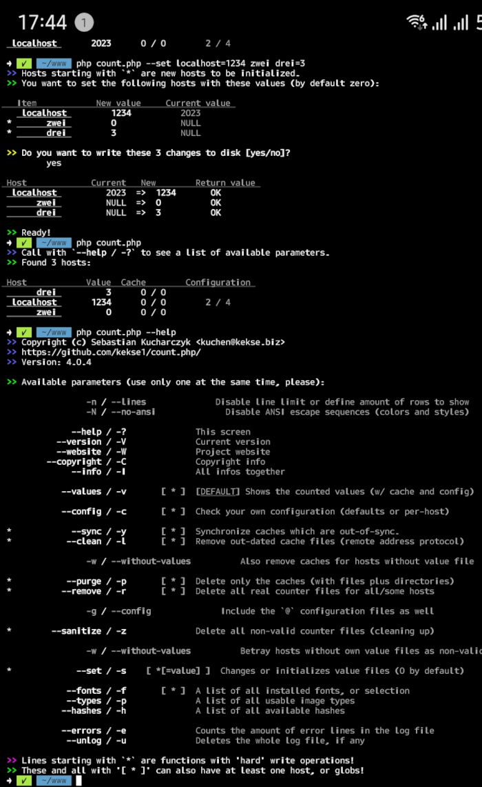
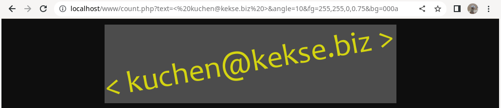

It's a universal [counter script](php/count.php). ... v**4.3.4**!

## Index
1. [Installation](#installation)
	* [Dependencies](#dependencies)
2. [Screenshots](#screenshots)
3. [Details](#details)
	* [Security](#security)
	* [Storage](#storage)
	* [Server and/or Client](#server-andor-client)
	* [Refresh](#refresh)
	* [Override](#override)
	* [Overwrites](#overwrites)
	* [Cleaning](#cleaning)
	* [Privacy](#privacy)
	* [Errors](#errors)
	* [String filter](#string-filter)
	* [Security test](#security-test)
4. [Drawing](#drawing)
	* [Parameters](#parameters)
	* [Dependencies](#dependencies-1)
5. [Configuration](#configuration)
	* [No more constants.](#no-more-constants)
	* [Per-host config overwrite](#per-host-config-overwrite)
	* [Relative Paths](#relative-paths)
	* [Colors](#colors)
	* [Radix/Base](#radixbase)
	* [Automatical file creation](#automatical-file-creation)
6. [Modes](#modes)
	* [Text mode](#text-mode)
	* [Readonly mode](#readonly-mode)
	* [Drawing mode](#drawing-mode)
	* [Zero mode](#zero-mode)
	* [Hide mode](#hide-mode)
	* [Test mode](#test-mode)
	* [CLI mode](#cli-mode)
		* [Wrapper script](#wrapper-script)
		* [ANSI Escape Sequences](#ansi-escape-sequences)
		* [List output limit](#list-output-limit)
		* [The argument vector](#the-argument-vector)
		* [Operations](#operations)
			* [File Scheme](#file-scheme)
7. [Exports](#exports)
8. [Modules](#modules)
9. [FAQ](#faq)
10. [The original version](#the-original-version)
11. [Copyright and License](#copyright-and-license)

## Installation
The easiest way is to just use this `count.php` with it's default configuration: copy it to some path in your htdocs/,
and **That's all**! :-) The configured counter directory `count/` will automatically be created.

> **Warning**
> If your HTTPD uses another user than you've for regular use, you _maybe_ would like to adapt `KEKSE_MODE_{DIR,FILE}`!
> It's an open door for other users on the system, but if you really need console access under this circumstances,
> you'd like to do this..

> **Note**
> I'd suggest you to also copy the **[`count.sh`](php/count.sh)** (wrapper) shell/bash script to easily execute the script
> in it's [CLI mode](#cli-mode)! Download it _into the same directory as the `count.php`_ and set (just once) `chmod +x count.sh`!
> You can symlink to it from everywhere, it'll always use the `count.php` from within the same directory where the script's located at.

The possible, possibly complex rest is described in the [Configuration section](#configuration).

As an important example, hence here's another file system change necessary: if you want to enable the `drawing` routines. Then the
HTTPD needs access to a sub directory `fonts/`, with at least one installed font in it (which you need to set as the _default
font_ in the `font` setting).

> **Warning**
> FreeType seems to only support **`.ttf`** fonts. My script is adapted to this, so other font formats are **not** supported.

> **Note**
> You can just use the [`fonts/`](fonts/) shipped with(in) this repository.

So, **that's** all. :D~

> **Note**
> If you want to edit the default configuration, take at look at the [Configuration section](#configuration).
> And to make sure your settings are valid, you can call this script like this: [**`php count.php --config / -c`**](#cli-mode).

### Dependencies
**NO** dependencies.

**Except** if you're enabling the `drawing` configuration. In this case it's the
[**GD Library**](https://www.php.net/manual/en/book.image.php). More infos below, in the
[Drawing section](#drawing) and it's [drawing dependencies](#dependencies-1) sub section.

## Screenshots

## Details
> **Note**
> You can easily manage all the values **etc.** via command line!
> Look at the [CLI mode](#cli-mode) section for details.

#### text/plain
By default the script generates a **`text/plain`** (plus charset) output, so you can easily embed the counting value via
**`XMLHttpRequest()`** or the **`Fetch API`**. This `Content-Type` (a [HTTP](https://wikipedia.org/wiki/HTTP) header) is
configurable via the `content` setting (see the [Configuration](#configuration) section).

This is preferred if you'd like to fit the counter's style exactly to your website. You can define every (CSS) details, etc.

#### Image
The other way is to embed the counter as (_server-side drawn_) `` (`png` and `jpg` types supported). That's also good,
and a lot easier to embed (for the most)!

Especially useful on a site like this one ([github.com](https://github.com/kekse1/)), where you can't just script anything..

> **Warning**
> For this to work the `drawing` configuration needs to be **enabled** (_is the default_). But then fonts must be installed!

On top of this `README.md` I included my (private) counter via HTML `` tag. .. *worx!*

### Security
I was very concerned about the security.. there are many features for this, so I'm not going to explain you all the details
in this [Details](#details) section. If you'd like to know more, just continue reading this _whole_ documentation, or maybe
even **read the fucking source**! ;)~

And I'm also not going to explain all the configuration details in this overview. Just read further, again..

### Storage
Instead of using big databases or an own format in one file or so (what I preferred in ~~**1998**~~ ;-), I'm chosing the
**file system** as _**very** efficient_ carrier! Really, it's much performance in it!

> **Note**
> Take a look at the [File Scheme](#file-scheme) sub section, to get to know which files are being used (which are _real_
> counter items of your base counter directory)!

It's used to store the counted values itself, one file per host. And if `server` setting is enabled, it also creates
a directory for each host, where every IP address (or their hashes, if [Privacy](#privacy) is a concern) will take one
file each. If you configured it, they'll also be cleaned, as often as you defined it (even though you can define to
_never_ delete any such file, to protocol the IP's, e.g.).

These IP files (with timestamps in it) will also use own cache files, one per host, where the amount of them is managed. So if their amount
is necessary to know, no repetition of `scandir()` (used `opendir()` and `readdir()` most times) is always slowing down things..

> **Warning**
> **All files got limits** .. for sure. And there's also a limit for automatical creation of files.

### Server and/or Client
If a cookie (if actived `client`) already confirmed that the client connected within the **`threshold`** (**2 hours by default**),
no `server` test will be done after this. And if a cookie doesn't work, there's still this IP test left (if `server` enabled).

> **Warning**
> If `threshold == 0` or `threshold === null`, both `server` and `client` will be overridden (to `false`); as this seems you
> don't need a `threshold` time.

### Refresh
If you are able to reload the counter dynamically on your web sites, please do it.

This would be great, because with every poll the timestamps get updated, so the `threshold` setting
(which gives you the logical, maximum time to refresh, btw.) is not the only prevention against multiple
countings; periodically polled it makes you some 'session' styles by adapting the timestamp, that will
never get too old this way.

So, if you're periodically polling this script (I'm doing it via **`XMLHttpRequest()`**), the client is not
being counted again after the `threshold` time over this 'session', until he disconnects. Then coming
back again _after_ the two hours (by default) he will get counted again. Pretty easy?

### Override
If(`override === true`), one can call the script's URL with `?override=(string)`, so neither regular
`$_SERVER['HTTP_HOST']` nor `$_SERVER['SERVER_NAME']` are being used, but an arbitrary (but filtered)
string (or just another host you define there).

> **Warning**
> On **any** override, it's expected this ain't a real host or smth.. so the `makeCookie()` is disabled then!

I don't really like it, but if you need this feature, just use it. Works great.

> **Warning**
> The `auto` setting is also overridden in this case, so it's not possible to always use any arbitrary parameter
> (also important for security). Thus, you first have to create a value file to the corresponding string!

And now the `override` setting can also be a (non-empty) String, to define just one _fixed_ host(name) (or an
more or less arbitrary (but filtered, see `secureHost()`) identifier String) to use.

Every override set's the state (see `{get,set}State()`) `overridden = true`.

### Overwrites
Beneath the default configuration, any host (within the file system, as desribed above at [Storage](#storage))
can have it's own configuration (difference) file, to apply these only to these hosts itself. This is really
_optional_, but could maybe be very useful sometimes.

It came up since in earlier versions I defined the whole configuration via `define()`, which ended up in (too
much) **global** (namespace) declaration.. **BAD**. So now everything works even better than before this way
(and nearly **no** `define()` is being used now - except some in my own namespace).

> **Note**
> For more infos, see the [Per-host config overwrite](#per-host-config-overwrite) sub section!

### Cleaning
If configured, out-dated ip/timestamp files will be deleted (this and more is also possible in
the CLI (cmd-line) mode), if their timestamps are 'out-dated' (so if they have been written more
than `threshold` (by default 2 hours) seconds before).

If you define an `(integer)`, the cache will be cleared only if there are more files existing
than the (integer).

> **Warning**
> If you set it to **`(null)`**, every cleaning is **forbidden**, if you want to collect all the IPs?
> `(false)` would also never call the clean routine, except if the `limit` is exceeded.

### Privacy
And if privacy is one of your concerns, the IPs (in their own files with their timestamps) can
also be hashed, so noone can see them (including yourself, or the webmaster(s), .. even with
access to the file system). .. just enable the `privacy` setting.

### Errors

#### Log to file
Most errors will be appended to the `count.log` file (configurable via `log`), so webmasters etc. can
directly see what's maybe going wrong. But _due to security_, not everything is being logged.
Especially where one could define own `$_GET[]` or `$_SERVER[]` or so, which could end up in
flooding the log file!

> **Note**
> Logging with timestamps: seconds since the _UNIX epoch_ (the January 1st, 1970).

> **Note**
> Parsing this log file is easy: it begins with `[$timestamp]` and optional `$_source($_path)`; after this a regular
> colon with space `: ` starts the `$_reason` string itself. So you can use `cut -d':' -f{1|2} $file` to extract either
> the extended infos (`-f1`) or the reason/message itself (`-f2`).

> **Warning**
> As `cut` only handles one-char `-d` delimiters, you can't include the following space here.
> But you can `substr()` the message. In the `bash`, this is done via `${line:2}`.
> But best 'd be to `split()` or smth. similar by string `: ` (a colon and a space)!

### String filter
_All `$_SERVER[]` and `$_GET[]` are filtered to reach security_ (please don't ever trust any [user] input!).

I just abstracted both functions `secure{,Host,Path}()` to only one function, which is partially also
used by the `getParam()`.. both functions stayed: they internally use `secure()`, but the `secureHost()`
additionally does a `strtolower()` (via parameter which is passed straight to the base `secure()` (afair).

So here you gotta know which characters you can pass. The maximum length is 224 characters (by default, look
at the `KEKSE_LIMIT_STRING` constant), btw.

* **`a-z`**
* **`A-Z`**
* **`0-9`**
* **`=`**
* **`#`**
* **`,`**
* **`:`**
* **`(`**
* **`)`**
* **`/`** (limited)
* **`.`** (limited)
* **`-`** (limited)
* **`+`** (limited)

That's also important for the *optional* `?override=` GET parameter (see above), e.g., as hosts (etc.)
also won't ever be accepted 'as is'.

So I'm also securing the used `$_SERVER[]` variables, as e.g. via `Hostname: ...` in the HTTP header the
host could be poisoned as well!

#### **FQDN**'s
> **Note**
> The string filter (above) also removes any trailing `.` from the hostnames; so if you call from
> a web browser with a hostname plus trailing dot `.`, which is a **FQDN**, it'll be removed, so
> the counting is not disturbed (otherwise it would end up in another file for w/ and w/o `.`)!

### Security test
*Beneath some more or less routines* I even added some basic, _abstract_ file operation functions, which I'm using
**only** instead of the regular ones (listed below), and in the `checkPath()`.

> **Note**
> It's more or less nearly too much, but it's the last possibility for security, if the [string filter](#string-filter) failed or smth..

This **`securityTest()`** function checks:

* If path is really a string
* If path starts with `/` (all used paths are resolved)
* If any path component is `..`
* Most times also if path is below one of the counter base paths (as follows)

Used base paths of the counter are: [ `path`, `log`, `fonts`, `modules` ].

## Drawing
The normal way is to return the plain value (by default w/ **`Content-Type: text/plain;charset=UTF-8`**),
but I've also implemented some drawing routines, to embed the counter value as **``**.

If allowed by `drawing` setting, just use either `?draw` for all possible options, or just `?zero` to
draw a (nearly) empty output image (hidden counter, e.g. .. whereas there's also the `hide` setting!).

### Parameters
To use it, enable the `drawing` option and call script with (at least!) `?draw` \[or `?zero`\] (GET)
parameter. More isn't necessary, but there also also some GET parameters to adapt the drawing, as follows..

> **Note**
> Such *GET* parameters need a prefix before the variable name. It's either **`?`** for the first parameter,
> or **`&`** for all following ones. **They are defined in the request _URL_**!

| Variable     | Default [Settings](#settings) \[= (value)\]     | Type               | Description / Comment(s)                                           |
| -----------: | :---------------------------------------------- | -----------------: | -----------------------------------------------------------------: |
| **`draw`**   | (`drawing` needs to be enabled!) = `false`      | **No value**       | By default _no_ \                                            |
| **`zero`**   | (`drawing` again) (overrides the options below) | **No value**       | _Alternative_ to `?draw`                                           |
| **`size`**   | `64px`                                          | **String/Double**  | >= 3 and <= 512, `32px`, `24pt`                                    |
| **`min`**    | `false`                                         | **Boolean**        | Reduce image height as much as possible (instead of fixed `?size`) |
| **`unit`**   | `px`                                            | **String**         | If `size` is w/o `unit` _suffix_                                   |
| **`font`**   | `Candara`                                       | **String**         | Also see `fonts`                                                   |
| **`fg`**     | `0, 0, 0, 1`                                    | **String**         | See [Colors](#colors)                                              |
| **`bg`**     | `255, 255, 255, 0`                              | **String**         | See [Colors](#colors)                                              |
| **`angle`**  | `0.0`                                           | **String/Double**  | Anticlockwise [ '', 'deg', 'rad' ]                                 |
| **`h`**      | `0.0`                                           | **String/Double**  | >= -512 and <= 512, `32px`, `24pt`                                 |
| **`v`**      | `0.0`                                           | **String/Double**  | >= -512 and <= 512, `32px`, `24pt`                                 |
| **`x`**      | `0.0`                                           | **String/Double**  | >= -512 and <= 512, `32px`, `24pt`                                 |
| **`y`**      | `0.0`                                           | **String/Double**  | >= -512 and <= 512, `32px`, `24pt`                                 |
| **`type`**   | `'png'`                                         | **String**         | See `--types / -t`                                                 |
| **`text`**   | (`drawing` thing, but for regular text strings  | **String**         | See [configuration `text`](#configuration); combined w/ any of here|

> **Note**
> Double and Float are two different types in many languages (4 vs. 8 bytes long, or 32 vs. 64 bits), **but in PHP** they
> seem to be exactly the same! I choosed the `double` notation here, because that's what `gettype()` returns. ;-)

#### Explaination
`size` is either an Integer or Double/Float. In this case the optional `unit` is considered (also in the configuration).
Or it can also be a String with unit suffix [ `px`, `pt` ]. `unit` can have one of these both strings, but will not be used
if `size` is already with (valid) suffix!

`min` can get `y[es]/n[o]/1/0/-/+` as $_GET[] value. If not defined, we're using the `getConfig()` function to read the
(current, also overwritten) configuration. If set to `true`, the image won't be scaled up to the real `?size` parameter value,
but will be reduced in it's height as much as possible (if resulting text is smaller than expected or smth. like this).
It's NOT the default, because **I** like to get an image with the size I really define.. and it fits better into the line
alignment..!

> **Note**
> Nevertheless, the _maximum_ height will always be the defined `?size` (or from the configuration), it can never be greater!

So, `unit` sets the default unit to use for `h`, `v`, `x`, `y` and `size`, if there are only `Integer/Double` values, not a String with unit suffix.

The selected `font` needs to be installed in the `fonts` directory, as `.ttf`. The parameter is normally without '.ttf' extension, but this doesn't matter at all.

`fg` and `bg` are colors, see the [Colors](#colors) sub section of the [Configuration](#configuration) section.

`angle` will rotate the whole image anticlockwise (or just use negative values! ;-) .. supported are either integer or
double/float values (assumed as being in 'degrees'), and Strings with a unit [ `deg`, `rad` ] as suffix.

`x` and `y` are just moving the text along these both axis. `v` is the space above and below the text, `h` is to the left and
the right. They all can also be negative values, and can be with or without unit suffix. If no suffix defined, they'll be
scaled by using the `?unit` (or the value in the configuration(s), if not defined as parameter).

Last but not least, the `?type` can atm be set to `png` and `jpg`, whereas `png` is absolutely preferred (example given:
`jpg` does not have the best alpha-channel (transparency) support)!

And now, _new_: `?text` drawing, mostly intended for 'secure' drawing E-Mail addresses, without that crawlers or bots can automatically
extract these links...

> **Note**
> **All parameters are optional**, but only the **`?draw`** isn't, and needs to be set if you want a graphical
> output. **`?zero`** is also enabling drawing mode, but you won't see anything at all ... and this, and only
> `?zero` and `?text` can be set without `?draw`, to draw nevertheless..

### Dependencies

#### Libraries
> **Warning**
> The [**GD Library**](https://www.php.net/manual/en/book.image.php) has to be installed for this feature.

> **Note**
> The GD library also needs 'FreeType' support with it, as we're drawing with True Type Fonts (this is
> **not** checked within `--config / -c`, btw.).

Runned by a web server with enabled `drawing` option and also aktived via `?draw` will only call this
drawing mode if module is installed. If not, the regular (text/plain) output will nevertheless be used;
to avoid error output (even though it's bad that you're using an `` tag..... but error output
wouldn't be visible in this case at all).

#### Fonts
The **second dependency** is a configured `fonts` directory with (`.ttf`) font(s) installed in it (and
if you don't specify this via `?font` it really *needs* to be pre-set via `font` setting); ...

## Configuration
The configuration is an associative array of various settings.

You can test if they are valid by using the **`--config / -c`** command line argument (with optional argument(s),
see the [Per-host config overwrite](#per-host-config-overwrite) section below).

### No more constants.
Here are the current _default_ settings, including the possible types

> **Note**
> Every variable with a big, bold ⚠️ will **never** be overwritten by any [per-host config overwrite](#per-host-config-overwrite).
> But this will always be checked (injection not possible).

This `DEFAULTS` are stored in the script file itself, in a `const` array.

| .. | Name             | Default value                | Possible types/values                          | Description / Comment(s)                          |
| -- | ---------------: | :--------------------------- | ---------------------------------------------: | :-----------------------------------------------: |
| ⚠️ | **`path`**       | `'count/'`                   | **String** (non-empty)                         | See [Relative paths](#relative-paths) below       |
|    | **`text`**       | `32`                         | **Boolean/Integer**                            | Whether to allow text drawing; Integer is char max|
|    | **`log`**        | `'count.log'`                | **String** (non-empty)                         | File to log errors to (also see link above)       |
|    | **`threshold`**  | `7200`                       | **Integer**/**NULL**                           | How long does it take till counting again?        |
|    | **`auto`**       | `32`                         | **Boolean**/**Integer**/**NULL**               | Create count value files automatically?           |
|    | **`hide`**       | `false`                      | **Boolean**/**String**                         | Show the counted value or hide it?                |
|    | **`client`**     | `true`                       | **Boolean**/**NULL**                           | Enables Cookies against re-counting               |
|    | **`server`**     | `true`                       | **Boolean**                                    | Enables cache/ip/timestamp files, like above      |
|    | **`drawing`**    | `false`                      | **Boolean**                                    | Essential if using `?draw` or `?zero`!            |
| ⚠️ | **`override`**   | `false`                      | **Boolean**/**String** (non-empty)             | Instead of using `$_SERVER[]` `$_GET[]` or String |
|    | **`content`**    | `'text/plain;charset=UTF-8'` | **String** (non-empty)                         | Non-graphical mode produces only value output     |
|    | **`radix`**      | `10`                         | **Integer**                                    | See [Radix](#radix) below .. change the output(s) |
|    | **`clean`**      | `true`                       | **NULL**/**Boolean**/**Integer**               | Clean outdated cache files and the FS things?     |
|    | **`limit`**      | `32768`                      | **Integer**                                    | Maximum number of files, in base dir and sub dir! |
|    | **`fonts`**      | `'fonts/'`                   | **String** (non-empty)                         | Directory with installed '.ttf' fonts @ path      |
|    | **`font`**       | `'Candara'`                  | **String** (non-empty) \[see `--fonts / -f`\]  | Default font to use                               |
|    | **`size`**       | `64`                         | **String**/**Double** (>=3 and <=512)          | Either Double, w/ `unit`, or String `pt` or `px`  |
|    | **`unit`**       | `px`                         | **String** [ `pt`, `px` ]                      | Will be used if `size`/`x`/`y`/`h`/`v` is numeric.|
|    | **`fg`**         | `'rgb(0, 0, 0)'`             | **String** (non-empty)                         | See [Colors](#colors) below                       |
|    | **`bg`**         | `'rgba(255, 255, 255, 0)'`   | **String** (non-empty)                         | See [Colors](#colors) below                       |
|    | **`angle`**      | `0`                          | **Double/String**                              | Anticlockwise rotation; (int) vs. `*deg` or `*rad`|
|    | **`x`**          | `0`                          | **Double/String** (<=512 and >=-512)           | Movement of drawed text left/right                |
|    | **`y`**          | `0`                          | **Double/String** (<=512 and >=-512)           | Same as above, but for up/down                    |
|    | **`h`**          | `0`                          | **Double/String** (<=512 and >=-512)           | Horizontal space from text to end of image        |
|    | **`v`**          | `0`                          | **Double/String** (<=512 and >=-512)           | Vertical space, like above                        |
|    | **`type`**       | `'png'`                      | **String** (non-empty) \[see `--types / -t`\]  | Only `png` and `jpg` supported 'atm' (are best!)  |
|    | **`privacy`**    | `false`                      | **Boolean**                                    | Hashes the IPs (stored if `server` is enabled)    |
|    | **`hash`**       | `'sha3-256'`                 | **String** (non-empty) \[see `--hashes / -h`\] | This is the hash algorithm. Used for Cookies, too |
|    | **`error`**      | `null`                       | **NULL**/**String**                            | If not (null), it will be shown on **any** error  |
|    | **`none`**       | `'/'`                        | **String**                                     | And this is shown when `!auto` w/o value file..   |

It'd be better to create a `.htaccess` file with at least `Deny from all` in your `path` directory. But consider that not every HTTPD (web server)
supports such a file (e.g. `lighttpd`..)!

> **Note**
> Same as above: in PHP Double and Float are the same. But `double` is what `gettype()` returns.

### Per-host config overwrite
The per-host configuration allows a _sub-set_ of settings (look at the `CONFIG_STATIC` const array) to 'overwrite'
the default configuration (see `DEFAULTS`). And they're just 'shifted', which makes it very efficient, and even very
easy to unload again. So, they are **differences** to apply if this host with the file (`@`-prefixed) is selected.

They get automatically loaded, and reside beneath the other counter files.

> **Note**
> To check _these_ configuration (difference) files, the regular **`--config / -c`** command line parameter must be
> extended with at least one {host,override}-name or even **glob**(s). Checks one or more of this per-host config files.

Hosts with their own configuration (difference) overwrites have their own mark in the last `Configuration` column, where
the first (bold) integer indicates how many real, _valid_ configuration items it has, the second value (after `/`) shows
how many items there are available in the host config file (as usual a JSON file with `@` prefix char).

> **Warning**
> The configuration files are encoded in the [JSON format](https://json.org/) (and don't need to hold the whole
> set of available configuration items)! and **yes**, this is a *warning*.. xD~

### Relative paths
Absolute paths work as usual. But relative paths are used here in two ways.

If you define your `path`, `log` or `fonts` as simple directory name like `count` or `count/`, it'll
be resolved from the location of your `count.php` script (using `__DIR__`). But to define this relative
to your current working directory, you've to define those paths with starting `./` (it's where the script
gets called; maybe as symbolic link or by defining a path via e.g. `php ./php/count.php`).

> **Note**
> `../` is relative to the `__DIR__`, unlike `./`!
> If you also want to make this relative to the current working directory `$PWD`, try `./../`.

### Colors
Supported formats are:

* **`argb()`** (with 3x (0-255) and 1x (0.0-1.0));
* **`rgb()`** (with 3x (0-255));
* **`(comma separated)`** (list of 3x (0-255) and optionally 1x (0.0-1.0));
* **`#`** hex color strings (w/ and w/o `#` prefix, with a length of one of: [ 3, 4, 6, 8 ]);

> **Note**
> Above formats don't need to be defined exactly (by their names or the `#` hex char).
> The lengths are enough to determine which type it is. So just set a list of numbers or any hexadecimal notation.

### Radix/Base
The `radix` configuration should be an **Integer** between **2** and **36**. Default is, of course, **10**! :)~

But it's worth to mention that this parameter can also be changed in the `$_GET[]`-URL with which this script _can_ (optionally) be
called. Just use the `?radix=10` (here with it's default value, if not defined otherwise in the `radix` setting mentioned here above).

### Automatical file creation
This is the `auto` setting.

By default up to `32` value files will automatically be created, if not existing for a host. With overridden
host this setting is also overwritten: `true` if `override` setting or `$_host` is a String, and `false` in
all other cases.

> **Note**
> If amount of value files exceeds _this_ limit, or if set to `false`, you can easily initialize (or change..) these
> files via the `--set / -s <host[=0][, ... ]>` parameter in [CLI mode](#cli-mode), with _optional_ value (integer)
> for each host (after `=` equal sign). But if value is unspecified, it defaults to `0`.

Additionally, the `limit` setting is also used for a 'hard' maximum, even if 'auto' integer is greater or without real (int) limit!

> **Warning**
> To (temporarily) **disable** the _whole counting unit_, set `auto = null`. ;)~

## Modes
Some of the modes are as follows. And they can **partially** be combined as well!

### Text mode
If allowed by the [configuration `text`](#configuration), you can also draw a regular text beneath the counter values or smth.

This feature is mostly there as I wanted to secure up mail addresses, e.g.. so without HTML code no (regular...) crawler or bot will
be able to automatically grep such addresses. This is the main reason for this feature.

... but it's also possible to draw _any_ regular text, if it's within the configured maximum character count
(which is by default set to `32`, or `64` if `text` setting is set to `true`.. `false` or `<=0` disables it).

> **Note**
> The counter will also count in this mode, if called without `?readonly / ?ro` parameter.

### Readonly mode
You can use the script regularily, but pass `?ro`. That will only return/draw the current value without writing any
files or cookies. The value is not changed then. So one can view it without access to the file system or the CLI mode.

Some functions won't be declared here, etc., just for more runtime performance and resource reasons.

### Drawing mode
By using `?draw`, if `drawing` setting is enabled, the output will not be `text/plain` (or whatever you
define in `content`), but `image/png` or `image/jpeg`, so you can embed the counted value in ``.

Please take a look at the [Drawing section](#drawing).

### Zero mode
The `?zero` should be set instead of `?draw`, just to draw an 'empty' (1px) ``. If not defined otherwise,
it'll count invisible this way. :)~

### Hide mode
By setting `hide` to true or a string, this string will be shown instead of the real count value.
This feature is there for private couting, without letting the users known how much visitors you already
had.

Beware: if you _really_ want to hide these values, please create the `.htaccess` w/ `Deny from all` in
your `path` directory!

> **Note**
> If `hide` is `true` (instead of a string), ouput will be a random integer. :]~

### Test mode
With `?test` there will nothing be counted, and the output (can also be combined with `?draw`) will be
a random integer value.

### CLI mode
This is the **c**ommand **l**ine (**i**nterface) mode (just take a look at the [screenshot](#screenshot)
on top of this `README.md`..).

Here you can also test your configuration's validity by running the script with **`--config / -c [*]`** parameter.

Calling this script without any parameters will show the currently counted values (and more). Otherwise just
take a look at the sub section [The argument vector](#the-argument-vector) below, or/and look at the section
[Operations](#operations), to understand how you can manage your whole `count/` directory better.

And if you need help, don't be shy and call this script with **`--help / -h`** parameter!

> **Note**
> The output of long lists is, by default, limited to 40 entries/rows. If you want to omit this,
> add the **`--lines / -n`** parameter. _Optionally_ is even an integer possible, to directly set the amount
> of maximum rows used (even if there'll be usually a prompt to ask you for more or less..).

> **Note**
> There's also the parameter **`--no-ansi / -N`** to switch off [ANSI escape sequences](#ansi-escape-sequences)!
> This is mentioned for terminals which don't support colors and styles this way.. by default it's true.

#### Wrapper script
In the past you had to call `php count.php` manually (as a shebang isn't possible with a web server script,
due to the header..). **Now** I've added a script **[count.sh`](php/count.sh)**, which will wrap this for you,
and also argue with any parameters defined. **Just use this helper script in the command line, please!**

#### ANSI Escape Sequences
I'm using ANSI Escape Sequences, for styling and coloring the text in a console. For the best support (that every terminal, that implement these sequences),
I've decided to only use the most rudimentary sequences, so only some basic styles (underline, bold, etc.) and only 4-bit colors (so only max. 8 real colors).

To globally disable these sequences, either use the `define('KEKSE_ANSI', true)` on top of the script,
or (even better) just call the script with the (optional) parameter **`--no-ansi / -N`**!

> **Warning**
> As I'm using these sequences **plus** the `printf()` function (etc.), I also implemented my own `\kekse\strlen()` function, plus `\kekse\less()`,
> where these sequences are being filtered out!

> **Note**
> I also own a _much better_ implementation of more than just these basic sequences, but in JavaScript: see my [lib.js / Library.js](https://github.com/kekse1/lib.js/);
> the real file path is located in this path: [lib.js/tty/ansi.js](https://github.com/kekse1/lib.js/blob/git/lib.js/tty/ansi.js).

#### List output limit
If you're using _many_ hosts or many files are affected or smth. like this, I've also integrated a limitation of lines/rows outputted in the console.
So if there are more than `40` (default) rows/lines to output, you're asked if you want to also show the rest of the list, or the output is stopped (w/ comment).

You can globally disable this behavior by changing the `define('KEKSE_LIMIT_TTY', 40)` (or even `KEKSE_LIMIT_TTY_PROMPT` to disable the question meantioned above),
or (better) just call this script with either pure **`--lines / -n`** (to disable the limit), or define another limit by passing it to this parameter.

> **Note**
> You can pass it by either **`--lines (int)`** or **`--lines=(int)`** (same with **`-n`**).

#### The argument vector
The following parameters are the main [CLI](#cli-mode) functions.

> **Note**
> They can't be combined! .. first occurence 'counts'. ;)~

> **Warning**
> Parameters marked with ⚠️ are functions with 'hard' data write operations! .. to learn how to use these functions
> (to handle the whole `count/` base directory), scroll down to the [Operations](#operations) section!

Here's the list of all the parameters/functions:

| .. | Short    | Long                            | Description                                                                         |
| -- | -------: | :------------------------------ | :---------------------------------------------------------------------------------- |
|    | **`-?`** | **`--help`**                    | Shows the link to this website..                                                    |
|    | **`-V`** | **`--version`**                 | Print current script's version.                                                     |
|    | **`-W`** | **`--website`**                 | Print URL to this project page (on github.com atm.)                                 |
|    | **`-C`** | **`--copyright`**               | Shows the author of this script. /me ..                                             |
|    | **`-I`** | **`--info`**                    | All the above infos at once                                                         |
|    | **`-c`** | **`--config`** \[*\]            | Verify DEFAULT or, by arguments, per-user configurations                            |
|    | **`-v`** | **`--values`** \[*\]            | Shows all vales and more.                                                           |
| ⚠️ | **`-y`** | **`--sync`** \[*\]              | **Same as above, but with cache synchronization..**                                 |
| ⚠️ | **`-l`** | **`--clean`** \[*\]             | **Clean all _outdated_ (only!) cache items**                                        |
| ⚠️ | **`-p`** | **`--purge`** \[*\]             | **Delete the cache(s) for all or specified hosts.**                                 |
| ⚠️ | **`-r`** | **`--remove`** \[*\]            | **Totally remove any host (all, or by arguments)**                                  |
| ⚠️ | **`-z`** | **`--sanitize`**                | **Delete file rests, which don't fit into the regular [file scheme](#file-scheme)** |
| ⚠️ | **`-s`** | **`--set`** \<...\>             | Sets (optional) value for the defined host(s) \[without value it's (0) by default\] |
|    | **`-f`** | **`--fonts`** \[*\]             | Available fonts for drawing ``. Globs allowed.                                 |
|    | **`-t`** | **`--types`**                   | Available image types for drawing output.                                           |
|    | **`-h`** | **`--hashes`**                  | Available algorithms for `hash` config.                                             |
|    | **`-e`** | **`--errors`**                  | Counts the error log lines.                                                         |
|    | **`-u`** | **`--unlog`**                   | Deletes the whole error log file.                                                   |

Additional arguments within **`[]`** are optional (and most **do** support GLOBs), and those within **`<>`**
are _required_ ones. Most **`*`** arguments can be defined multiple times, for more hosts, e.g.

As hint for myself I've saved [glob.txt](docs/glob.txt) in this repository.

> **Warning**
> Using globs requires quoting or escaping most times, as most shells will try to directly
> resolve them.. if it works sometimes, it's just because the shell didn't find any match (then the
> original glob is being encoded 'as is').

> **Warning**
> When printing a list of files to delete or smth. like this, they require console rows/lines, of course.
> Some lists could be 'too long', so we limit their output to `KEKSE_TTY_LIMIT` rows/lines. If you need to see
> **all** list items, use the additional parameter **`--lines / -n`**. Then the whole list is being outputted.

> **Note**
> The `--config / -c [*]` can also have *optional* host(/override) arguments (also **glob**s), to not check the whole
> default/global configuration, but the overrided ones (by a [per-host config overwrite](#per-host-config-overwrite)).

##### Modifiers
These are the _optional_ modifiers, mostly for specific functions (listed above). So they're not calling a function,
they modify their behavior!

| Short    | Long                   | Related function        | Description                                                                     |
| -------: | :--------------------- | :---------------------- | :------------------------------------------------------------------------------ |
| **`-n`** | **`--lines`**          | (*)                     | Disables limitation on outputted lines or set specific value (optional argument)|
| **`-N`** | **`--no-ansi`**        | (*)                     | To disable the ANSI escape sequences, e.g. in 'broken' terminals, etc..         |
| **`-g`** | **`--config`**         | `--remove`              | Will also remove the per-host configuration files (safed by default)            |
| **`-w`** | **`--without-values`** | `--sanitize`, `--clean` | All host files are being deleted, if no corresponding _value_ file is available |

> **Note**
> The **`--lines / -n`** modifies output of 'many' functions, whereas the others are for only one function (see 3rd column)!

#### Operations
This section explains the most important operations on the file system storage.

> **Warning**
> Any file deletion needs to be confirmed by you, after counting (maybe even listing) the files which would be deleted.
> There'll appear a question, where you have to type in **`y[es]`** or **`n[o]`**.

> **Note**
> Any of these operations (but `--sanitize / -z`) can optionally be argued with one or more target hosts,
> and they can also be GLOBs (but think about escaping or quoting them), like also `--fonts / -f`.

> **Note**
> NONE of the deleting functions will delete `.htaccess` files, so the others defined in `KEKSE_KEEP*`!

###### File Scheme
> **Note**
> First it's essential to explain you the Scheme of file system items for this counter. Then, in the following sub sections
> you'll see exactly what happens why..

So, there are four elementary file types (for which I'm using two `define()` each: `KEKSE_COUNTER_`), as follows:

| Prefix Char | Type      | Meaning / Description                                                                                           |
| :---------: | :-------- | :-------------------------------------------------------------------------------------------------------------- |
| **`~`**     | File      | The counted values itself are being stored here (integers)                                                      |
| **`+`**     | Directory | (If `server` is enabled) It'll contain every IP or their Hash as one file each; containing (integer) timestamps |
| **`-`**     | File      | (If `server` is enabled) These are caches to store the amount of real cache files per **`+`**                   |
| **`@`**     | File      | Somehow an exception.. just JSON files with difference configuration, each one for a host/override              |

##### Synchronization
**`--sync / -y`** function: Is a special case of the **`--values / -v`** function (so after regular showing all the values the sync routine starts).
Will synchronize the cache files with the cache directories! Nothing else, so in case of out-of-synced cache files they're the only ones which get changed!

_Optional parameter(s):_ Host/Override names or **glob**s (to match for hosts).

> **Warning**:
> As _exception_: if cache directories are without any cache files, they and their cache files get totally deleted!

##### Cleaning
**`--clean / -l`** function: Will search for **outdated** (timestamp) files in the cache directories (for any or specified host(s)). They contain timestamps,
and when they exist longer than the `threshold` setting, they can be deleted. Also see the `clean` setting: if not disabled, this will also happen when the
script is being called by web client (so in regular counting mode), either always, or when the amount of cache files exceeded the (soft) limit in `(int)clean`.

_Optional parameter(s):_ Host/Override names or **glob**s (to match for hosts). More optional parameters are:
| Short    | Long                   | Meaning / Description                                                                                                                          |
| -------: | :--------------------- | :--------------------------------------------------------------------------------------------------------------------------------------------- |
| **`-w`** | **`--without-values`** | Delete `KEKSE_COUNTER_DIR` and `KEKSE_COUNTER_FILE` files if no proper `KEKSE_COUNTER_VALUE` file was found. _Exception_: doesn't delete `KEKSE_COUNTER_CONFIG` files! |

> **Warning**
> The `threshold` is maybe not set to an integer above zero, in this case the whole cache directories will be deleted.

> **Warning**
> It's important to know that a [per-host config overwrite](#per-host-config-overwrite) may define an additional `threshold` time for a host. In this case
> _this_ specific time will be used to check for outdated cache files!! And if it's not an integer above zero, the whole cache directory will be deleted, too.

> **Warning**
> If a cache directory exist for a host/override which is not available as (`~` prefixed) **value** file, you need to also define **`--without-values / -w`** parameter if the whole
> cache should also be deleted. Otherwise it'll be handled as usual.

> **Warning**
> Will also delete any file in the cache directories which are no _regular_ files.

##### Purging
**`--purge / -p`** function: This function deletes all the cache files and directories for selected/all hosts. So only the `KEKSE_COUNTER_DIR` directories,
with all their timestamp files in them, plus the corresponding caching `KEKSE_COUNTER_FILE` files which contain the amount of timestamp files for each directory.

_Optional parameter(s):_ Host/Override names or **glob**s (to match for hosts).

##### Removing
**`--remove / -r`** function: Will delete **any** (real, valid) host file, except the per-host configuration overwrites. _Except_ if the **`--config / -g`** parameter is also defined (also
possible in combination with the globs or hosts/overrides). With this the configuration files to the specified or found hosts will also be deleted!

_Optional parameter(s):_ Host/Override names or **glob**s (to match for hosts).

##### Sanitizing
**`--sanitize / -z`** function: Deletes any file in the counter directory and every `KEKSE_COUNTER_DIR` sub directory which doesn't fit in there. **Foreign** files the counter doesn't need.

_Optional parameter(s):_ Host/Override names or **glob**s (to match for hosts). More optional parameters are:
| Short    | Long                   | Meaning / Description                                                                                                                          |
| -------: | :--------------------- | :--------------------------------------------------------------------------------------------------------------------------------------------- |
| **`-w`** | **`--without-values`** | Delete `KEKSE_COUNTER_DIR` and `KEKSE_COUNTER_FILE` files if no proper `COUNTER_VALUE` file was found. _Exception_: doesn't delete `KEKSE_COUNTER_CONFIG` files! |

> **Warning**
> This also holds for the cache directories, which will also be inspected, so all non-_regular_ files in there will be deleted as well!

## Exports
For the **count(er)** implementation _itself_ I'm using the namespace **`kekse\counter`**.

> **Note**
> Namespaces used in this script are these ones:
> * `kekse`
> * `kekse\color`
> * `kekse\counter`
> * `kekse\console`
> * `kekse\console\ansi`

> **Note**
> Maybe you'd like to know that enabling the `KEKSE_RAW` (on top of file) will export all my extensions,
> but without the `\kekse\counter` namespace, and the base `counter()` function also won't get called.
> So you can include this script to get all my following functions without the counter part itself! ;)~

> **Note**
> This script only defines the `KEKSE_RAW` if not already defined: this way you can define it in any
> other PHP script which includes the `kekse` exports, e.g. via `require_once()`! :-D

The following _common functions_ (which tend to be used also in other scripts, as they're 'abstract' and useful also in other scripts)
are exported in my own **`kekse`** namespace. *They could be really handy*:

| Function                    | Arguments                                                            | Description                                                                                    |
| --------------------------: | :------------------------------------------------------------------- | :--------------------------------------------------------------------------------------------- |
| **`is_number()`**           | `$_item`                                                             | PHP is missing 'between' `is_int()` and `is_float()`.. as `is_numeric()` is also for Strings.. |
| **`strlen()`**              | `$_string`, `$_filter = false`, `$_binary = false`, `$_hidden = true`| Own version, mostly to count string length with filtered out ANSI escape sequences (or binary)!|
| **`less()`**                | `$_string`, `$_binary = false`, `$_hidden = true`                    | Wrapper for `strlen()` w/ `$_filter = null`, to not count, but to return a filtered string     |
| **`endsWith()`**            | `$_haystack`, `$_needle`, `$_case_sensitive = true`                  | ...                                                                                            |
| **`startsWith()`**          | `$_haystack`, `$_needle`, `$_case_sensitive = true`                  | ...                                                                                            |
| **`normalize()`**           | `$_path`                                                             | Implementation of **path** normalization (works)                                               |
| **`joinPath()`**            | `... $_args`                                                         | Combines multiple path components to a whole path string **(variadic function)**               |
| **`timestamp()`**           | `$_diff = null`                                                      | Integer: either the timestamp itself (unix seconds) or the difference to another timestamp     |
| **`removeWhiteSpaces()`**   | `$_string`                                                           | Removes any occurence of binary/non-printable chars and spaces (0..32, 127) .. wrapper function|
| **`removeBinary()`**        | `$_string`, `$_space = false`                                        | Same as `removeWhiteSpaces()`, but without spaces (if `$_space === false`, which is default)   |
| **`getParam()`**            | `$_key`, `$_numeric = false`, `$_float = true`, `$_fallback = true`  | Returns a `$_GET[]` variable **very secured** and _optionally_ converted (int, double, bool)   |
| **`unit()`**                | `$_string`, `$_float = false`, `$_null = true`                       | Splits into value and unit components, which so can be defined in one string only.             |
| **`color()`**               | `$_string`, `$_gd = null`                                            | See [Colors](#colors).. the `$_gd` argument is `true` if `extension_loaded('gd')`, `if(!bool)`|
| **`delete()`**              | `$_path`, `$_depth = 0`, `$_extended = false`                        | Function for **any** file deletion! Also recursively, w/ optional (int)depth (or true/false)   |
| **`checkPath()`**           | `$_path`, `$_file`, `$_log_error_source = null`, (**...**)           | Default routine to check for file existence or creation, and `chmod()` for more security       |
| **`limit()`**               | `$_string`, `$_length = 224` (`KEKSE_LIMIT_STRING`)                  | For a maximum string length. Also look at `KEKSE_LIMIT_STRING` (which is `224`, by default)    |
| **`secure()`**              | `$_string`, `$_lower_case = false`                                   | See [**String filter**](#string-filter): to avoid code injection or smth. similar              |
| **`secureHost()`**          | `$_string`                                                           | Wrapper for `secure()` with `$_lower_case = true` (as hostnames are not case sensitive, ...)   |
| **`securePath()`**          | `$_string`                                                           | _ATM_ only an alias for the base `secure()` itself. But maybe it'll be improved l8rs.          |
| **`readFile()`**            | `$_path`, `... $_args`                                               | Especially for reading files within a limited length.. extended version in `kekse\counter`     |
| **`writeFile()`**           | `$_path`, `$_value`, `... $_args`                                    | Nearly as above; the extended `kekse\counter` version is also build up upon `securityTest()`   |
| **`readInt()`**             | `$_path`, `... $_args`                                               | Uses `readFile()`, but is especially for managing the counter values or timestamp files, etc.  |
| **`writeInt()`**            | `$_path`, `$_int`, `... $_args`                                      | For writing integers.. uses `writeFile()`.                                                     |
| **`log()`**                 | [`*`,] `$_format`, `... $_args`                                      | (CLI feature) Write line to STDOUT, w/ or w/o EOL (or many) with **non-colored** ` >> ` prefix |
| **`info()`**                | [`*`,] `$_format`, `... $_args`                                      | (CLI feature) Write line to STDOUT, w/ or w/o EOL (or many) w/ **green** colored ` >> ` prefix |
| **`error()`**               | [`*`,] `$_format`, `... $_args`                                      | (CLI feature) Write line to STDERR, w/ or w/o EOL (or many) with **red** colored ` >> ` prefix |
| **`warn()`**                | [`*`,] `$_format`, `... $_args`                                      | (CLI feature) Write line to STDERR, w/ or w/o EOL (or many) w/ **orange** colored ` >> ` prefix|
| **`debug()`**               | [`*`,] `$_format`, `... $_args`                                      | (CLI feature) Write line to STDERR, w/ or w/o EOL (or many) with **blue** colored ` >> ` prefix|
| **`prompt()`**              | `$_string`, `$_return = false`, `$_repeat = true`                    | (CLI feature) Let the user decide between `y[es]`/`n[o]`, with **yellow** colored ` >> ` prefix|

*.. maybe even more? Maybe some aren't always available? TODO: take a more detail look at all this..*.

## Modules
*TODO*! Whenever I'm in the mood to implement this (a bigger thing..), I'm _thinking_ about (at least):
* **events**.php
* **notifications**.php
* **statistics**.php

## FAQ
This section grew as I got comments on my code. And I hope for your reviews, really! Please contact me,
if you would like to review my code. I don't bite, promised! xD~

### # Why not using a `class`?
Just because it ain't necessary. I've just set a `namespace kekse\counter`, so everything is no longer
in the global namespace.. that should be enough. It could even really be, that using classes would even
end up in more resource consumption.. so, I think it's O.K. as it is now.. 'old skewl'! :)~

bedenke.. why should I just create a `Counter` class instance, where no real member variables are given
(as all are stored on the disk), and to only call a function `count()`, just to let her directly return
a value (and/or print/draw it), and then, directly after this, the instance would get destroyed again!?
... just my two cents. :)~

### # Installation via [Composer](https://getcomposer.org/)?
I'm pretty sure there's no real 'installation' necessary here.. additionally, there are also **no real
dependencies** which the 'Composer' would need to install.

A **minimum installation** is described above, in the [Installation section](#installation), jfyi!

### # Isn't this all a little big for such a script?
At least I've heard this from a reviewer..

**Don't panic!** The runtime will never use nor even define all the functions etc.. their existence
is reduced by some `if()` and as some are **sub**-functions of other functions, and also by evaluating
a minimum first, to maybe return earlier; etc..

I promise not to bloat everything too much; it's just a matter of fact that this script has many
features and is highly configurable.. nevertheless there are some optimizations etc., so it really
doesn't consume *that* much cpu time or memory.

> **Note**
> As of v**4.3.3** there are 'only' **_10.248_ code lines** left (and there are nearly no comments).

*If you find more possible optimizations, don't be shy and contact me! I'd be really happy. :-)*

## The original version
**[The original version](php/original.php)** was a very tiny script as little helping hand for my web
projects. It rised a lot - see for yourself! :)~

## Copyright and License
The Copyright is [(c) Sebastian Kucharczyk](COPYRIGHT.txt),
and it's licensed under the [MIT](LICENSE.txt) (also known as 'X' or 'X11' license).
