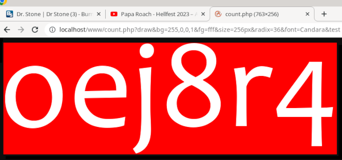

# [count.php](https://github.com/kekse1/count.php/)
It's a universal counter script. ... v**3.6.9**!

## Status
**De facto there's currently happening a _real big_ code rewrite**, where I'm replacing much parts by
completely new rewrites! Much things improved.. including all base [CLI mode](#cli-mode) operations on
the file system, and more.. **so stay tuned**, in some days or so here'll be a new version! ;-)

- [x] **_BIG_ improvement** in the [*drawing function(s)*](#drawing)!! Alignment is perfect now, size is always as requested, and supporting both `pt` and `px`
- [x] Supporting **rotations** now (see the `angle` setting and the `?angle` parameter); either degrees or radians, both are possible
- [x] **Fixed** the _jagged images_ when rotating ~[ 90, 180, 270 ] degrees (I think that's some 'mistake' or bug in PHP or the GD library...)
- [x] Completely ***new [configuration](#configuration) system***! With [Per-host config override](#per-host-config-overwrite)s; and **no more global namespace**
- [x] Much better **`--check / -c [*]`**. No more manual check, using a special 'vector' now.. **and** [per-host-config](#per-host-config-overwrite) **check** is also better now
- [x] Extended `delete()` functionality.. incl. floating point results, but also arrays with detailed countings! ..
- [x] To make user experience in the [CLI mode](#cli-mode) better: some basic [ANSI escape sequences](https://en.wikipedia.org/wiki/ANSI_escape_code) to beautify your terminal
- [x] Limited list output in the console.. cutting of too many rows/lines. WORX, even the cmdline switch to disable this behavior. :-)
- [ ] **Currently _massive_ rewrite of all [CLI mode](#cli-mode) operations.. IN PROGRESS! :)~**
- [ ] **And using `check_file()` (w/ `chmod()` for more security) plus clean up the file accessing routines in general!**
- [ ] **_To be exact_: ATM I'm doing a rewrite of \~half/third of the whole code!! xD~**
- [ ] Preparing better [RAW mode](#raw-mode) support, with better [(namespaces and) exports](#exports) (atm very *untested*, even known to not fully work)
- [ ] Planned, but yet future: Modules

## Index
1. [Status](#status)
2. [Example](#example)
3. [Installation](#installation)
	* [Dependencies](#dependencies)
4. [Details](#details)
	* [Security](#security)
	* [Storage](#storage)
	* [Server and/or Client](#server-andor-client)
	* [Refresh](#refresh)
	* [Override](#override)
	* [Overwrites](#overwrites)
	* [Cleaning](#cleaning)
	* [Privacy](#privacy)
	* [Errors](#errors)
	* [String filter](#string-filter)
5. [Drawing](#drawing)
	* [Parameters](#parameters)
	* [Dependencies](#dependencies-1)
6. [Configuration](#configuration)
	* [No more constants.](#no-more-constants)
	* [Relative Paths](#relative-paths)
	* [Colors](#colors)
	* [Radix/Base](#radixbase)
	* ['auto'](#auto)
	* [Per-host config overwrite](#per-host-config-overwrite-1)
7. [Modes](#modes)
	* [Readonly mode](#readonly-mode)
	* [Drawing mode](#drawing-mode)
	* [Zero mode](#zero-mode)
	* [Hide mode](#hide-mode)
	* [Test mode](#test-mode)
	* [RAW mode](#raw-mode)
	* [CLI mode](#cli-mode)
8. [Exports](#exports)
	* [Functions](#functions)
	* [Namespaces](#namespaces)
	* [Deletion](#deletion)
9. [Modules](#modules)
10. [FAQ](#faq)
11. [The original version](#the-original-version)
12. [Copyright and License](#copyright-and-license)

## Example

## Installation
The easiest way is to just use this `count.php` with it's default configuration: copy it to some path
in your web root, create a `count/` directory in the same path (with `chmod 1777` maybe - or just make sure that your web server can
access the file system). **That's all!** :)~

The possible, possibly complex rest is described in the [Configuration section](#configuration).

As an important example, hence here's another file system change necessary: if you want to enable the `drawing` routines. Then the
HTTPD needs access to a sub directory `fonts/`, with at least one installed font in it (which you need to set as the _default
font_ in the `font` setting).

> **Warning**
> FreeType seems to only support **`.ttf`** fonts. My script is adapted to this, so other font formats are **not** supported.

> **Note**
> You can just use the [`fonts/`](fonts/) shipped with(in) this repository. I've configured **`Intel One Mono`**
> (or **`IntelOne Mono`**) as the default font, btw.. looks great (see the random counter value on top of this `README.md`)!

So, **that's** all. :D~

> **Note**
> If you want to edit the default configuration, take at look at the [Configuration section](#configuration).
> And to make sure your settings are valid, you can call this script like this: [**`php count.php --check / -c`**](#cli-mode).

### Dependencies
**NO** dependencies.

**Except** if you're enabling the `drawing` configuration. In this case it's the
[**GD Library**](https://www.php.net/manual/en/book.image.php). More infos below, in the
[Drawing section](#drawing) and it's [drawing dependencies](#dependencies-1) sub section.

## Details
> **Note**
> You can easily manage all the values **etc.** via command line!
> Look at the [CLI mode](#cli-mode) section for details.

#### Text/HTML
By default the script generates a **`text/plain`** (plus charset) output, so you can easily embed the counting value via
**`XMLHttpRequest()`** or the **`Fetch API`**. This `Content-Type` (a [HTTP](https://wikipedia.org/wiki/HTTP) header) is
configurable via the `content` setting (see the [Configuration](#configuration) section).

This is preferred if you'd like to fit the counter's style exactly to your website. You can define every (CSS) details, etc.

#### Image
The other way is to embed the counter as (_server-side drawn_) `` (`png` and `jpg` types supported). That's also good,
and a lot easier to embed (for the most)!

Especially useful on a site like this one ([github.com](https://github.com/kekse1/)), where you can't just script anything..

> **Warning**
> For this to work the `drawing` configuration needs to be **enabled** (_is the default_). But then fonts must be installed!

On top of this `README.md` I included my (private) counter via HTML `` tag. .. *worx!*

### Security
I was very concerned about the security.. there are many features for this, so I'm not going to explain you all the details
in this [Details](#details) section. If you'd like to know more, just continue reading this _whole_ documentation, or maybe
even **read the fucking source**! ;)~

And I'm also not going to explain all the configuration details in this overview. Just read further, again..

### Storage
Instead of using big databases or an own format in one file or so (what I preferred in ~~**1998**~~ ;-), I'm chosing the
**file system** as _**very** efficient_ carrier! Really, it's much performance in it!

It's used to store the counted values itself, one file per host. And if `server` setting is enabled, it also creates
a directory for each host, where every IP address (or their hashes, if [Privacy](#privacy) is a concern) will take one
file each. If you configured it, they'll also be cleaned, as often as you defined it (even though you can define to
_never_ delete any such file, to protocol the IP's, e.g.).

These IP files (with timestamps in it) will also use own cache files, one per host, where the amount of them is managed. So if their amount
is necessary to know, no repetition of `scandir()` (used `opendir()` and `readdir()` most times) is always slowing down things..

> **Note**
> **All files got limits** .. for sure. And there's also a limit for automatical creation of files.

### Server and/or Client
If a cookie (if actived `client`) already confirmed that the client connected within the **`threshold`** (**2 hours by default**),
no `server` test will be done after this. And if a cookie doesn't work, there's still this IP test left (if `server` enabled).

> **Warning**
> If `threshold == 0` or `threshold === null`, both `server` and `client` will be overridden (to `false`); as this seems you
> don't need a `threshold` time.

### Refresh
If you are able to reload the counter dynamically on your web sites, please do it.

This would be great, because with every poll the timestamps get updated, so the `threshold` setting
(which gives you the logical, maximum time to refresh, btw.) is not the only prevention against multiple
countings; periodically polled it makes you some 'session' styles by adapting the timestamp, that will
never get too old this way.

So, if you're periodically polling this script (I'm doing it via **`XMLHttpRequest()`**), the client is not
being counted again after the `threshold` time over this 'session', until he disconnects. Then coming
back again _after_ the two hours (by default) he will get counted again. Pretty easy?

### Override
If(`override === true`), one can call the script's URL with `?override=(string)`, so neither regular
`$_SERVER['HTTP_HOST']` nor `$_SERVER['SERVER_NAME']` are being used, but an arbitrary (but filtered)
string (or just another host you define there).

> **Warning**
> On **any** override, it's expected this ain't a real host or smth.. so the `make_cookie()` is disabled then!

I don't really like it, but if you need this feature, just use it. Works great.

> **Warning**
> The `auto` setting is also overridden in this case, so it's not possible to always use any arbitrary parameter
> (also important for security). Thus, you first have to create a value file to the corresponding string!

And now the `override` setting can also be a (non-empty) String, to define just one _fixed_ host(name) to use.
Last possibility for an `override` is the `counter()` function itself (in it's first argument); but all the
strings are always filtered (by `secure_host()`), and every of these overrides sets `OVERRIDDEN = true`.

> **Note**
> If `override` **setting** is a `string`, then the `auto` is also being overridden as above, but to the
> `(true)` state (so the value file will always be created automatically).

### Overwrites
Beneath the default configuration, any host (within the file system, as desribed above at [Storage](#storage))
can have it's own configuration (difference) file, to apply these only to these hosts itself. This is really
_optional_, but could maybe be very useful sometimes.

It came up since in earlier versions I defined the whole configuration via `define()`, which ended up in (too
much) **global** (namespace) declaration.. **BAD**. So now everything works even better than before this way
(and nearly **no** `define()` is being used now - except some in my own namespace).

> **Note**
> For more infos, see the [Per-host config overwrite](#per-host-config-overwrite) sub section (of the
> [Configuration](#configuration) section)!

### Cleaning
If configured, out-dated ip/timestamp files will be deleted (this and more is also possible in
the CLI (cmd-line) mode), if their timestamps are 'out-dated' (so if they have been written more
than `threshold` (by default 2 hours) seconds before).

If you define an `(integer)`, the cache will be cleared only if there are more files existing
than the (integer).

> **Warning**
> If you set it to **`(null)`**, every cleaning is **forbidden**, if you want to collect all the IPs?
> `(false)` would also never call the clean routine, except if the `limit` is exceeded.

### Privacy
And if privacy is one of your concerns, the IPs (in their own files with their timestamps) can
also be hashed, so noone can see them (including yourself, or the webmaster(s), .. even with
access to the file system). .. just enable the `privacy` setting.

### Errors

#### Log file
Most errors will be appended to the `count.log` file (configurable via `log`), so webmasters etc. can
directly see what's maybe going wrong. _Due to security_, not everything is being logged. Especially
where one could define own `$_GET[*]` or so, which could end up in flooding the log file!

> **Note**
> Logging with timestamps: seconds since the _UNIX epoch_ (the January 1st, 1970).

#### Details
In `raw` mode, errors won't be logged to file and they won't `die()`, but `throw new Exception(..)`.

But normally you won't use this mode. So normally errors are stopping the execution via `die()` (but
it's an abstracted function to manage exceptions better). So if an error would be shown to the user
who called this script, it's either the `error` string, if set: just looks better and safes space on
the web site, and the user mostly won't need to see the detailed error message.. by default they'll
just see `/` (kinda variant of the numeric value).

Otherwise, without `error` setting, they'll see the error message itself (in shortened form, so clients
won't see file paths). .. When sending an error, the defined `content` header will be sent; also on drawing
errors.. so the image will break.

> **Note**
> I'm using two functions for this. Please use them, **never** a regular `die()` nor a `throw new Exception(..)`.
> These functions handle it better: `error()`/`log_error()`. Please _log_ errors only in safe situations, so no
> client is able to flood the log file..!

### String filter
_All `$_SERVER` and `$_GET` are filtered to reach security_ (please don't ever trust any [user] input!).

I just abstracted both functions `secure_{host,path}()` to only one function, which is partially also
used by the `get_param()`.. both functions stayed: they internally use `secure()`, but the `secure_host()`
additionally does a `strtolower()`.

So here you gotta know which characters you can pass. The maximum length is 224 characters (by default, look
at the `KEKSE_LIMIT` constant), btw.

* **`a-z`**
* **`A-Z`**
* **`0-9`**
* **`#`**
* **`,`**
* **`:`**
* **`(`**
* **`)`**
* **`/`** (limited)
* **`.`** (limited)
* **`-`** (limited)
* **`+`** (limited)

That's also important for the *optional* `?override=` GET parameter (see above), e.g., as hosts (etc.)
also won't ever be accepted 'as is'.

So I'm also securing the used `$_SERVER` variables, as e.g. via `Hostname: ...` in the HTTP header the
host could be poisoned as well!

#### **FQDN**'s
> **Note**
> The string filter (above) also removes any trailing `.` from the hostnames; so if you call from
> a web browser with a hostname plus trailing dot `.`, which is a **FQDN**, it'll be removed, so
> the counting is not disturbed (otherwise it would end up in another file for w/ and w/o `.`)!

## Drawing
The normal way is to return the plain value (by default w/ **`Content-Type: text/plain;charset=UTF-8`**),
but I've also implemented some drawing routines, to embed the counter value as **``**.

If allowed by `drawing` setting, just use either `?draw` for all possible options, or just `?zero` to
draw a (nearly) empty output image (hidden counter, e.g. .. whereas there's also the `hide` setting!).

### Parameters
To use it, enable the `drawing` option and call script with (at least!) `?draw` \[or `?zero`\] (GET)
parameter. More isn't necessary, but there also also some GET parameters to adapt the drawing, as follows..

> **Note**
> Such *GET* parameters need a prefix before the variable name. It's either **`?`** for the first parameter,
> or **`&`** for all following ones. **They are defined in the request _URL_**!

| Variable     | Default [Settings](#settings) \[= (value)\]     | Type               | Description / Comment(s)           |
| -----------: | :---------------------------------------------- | -----------------: | ---------------------------------: |
| **`draw`**   | (`drawing` needs to be enabled!) = `false`      | **No value**       | By default _no_ \            |
| **`zero`**   | (`drawing` again) (overrides the options below) | **No value**       | _Alternative_ to `?draw`           |
| **`size`**   | `size` = `64`                                   | **String/Double**  | >= 3 and <= 512, `32px`, `24pt`    |
| **`unit`**   | `unit` = `px`                                   | **String**         | If `size` is w/o `unit` _suffix_   |
| **`font`**   | `font` = `'IntelOneMono'`                       | **String**         | Also see `fonts`                   |
| **`fg`**     | `fg` = `'0,0,0,1'`                              | **String**         | See [Colors](#colors)              |
| **`bg`**     | `bg` = `'255,255,255,0'`                        | **String**         | See [Colors](#colors)              |
| **`angle`**  | `angle` = `0`                                   | **String/Double**  | Anticlockwise [ '', 'deg', 'rad' ] |
| **`h`**      | `h` = `0`                                       | **Integer**        | >= -512 and <= 512                 |
| **`v`**      | `v` = `0`                                       | **Integer**        | >= -512 and <= 512                 |
| **`x`**      | `x` = `0`                                       | **Integer**        | >= -512 and <= 512                 |
| **`y`**      | `y` = `0`                                       | **Integer**        | >= -512 and <= 512                 |
| **`type`**   | `type` = `'png'`                                | **String**         | See `--types | -t`                 |

> **Note**
> Double and Float are two different types in many languages (4 vs. 8 bytes long, or 32 vs. 64 bits), **but in PHP** they
> seem to be exactly the same! I choosed the `double` notation here, because that's what `gettype()` returns. ;-)

#### Explaination
`fg` and `bg` are colors, see the [Colors](#colors) sub section of the [Configuration](#configuration) section.

`x` and `y` are just moving the text along these both axis (in px). `v` is the space above and below the text,
`h` is to the left and the right. They both can also be negative values.

`angle` will rotate the whole image anticlockwise (or just use negative values! ;-) .. supported are either integer or
double/float values (assumed as being in 'degrees'), and Strings with a unit [ `deg`, `rad` ] as suffix.

`size` is either an Integer or Double/Float. In this case the optional `unit` is considered (also in the configuration).
Or it can also be a String with unit suffix [ `px`, `pt` ]. `unit` can have one of these both strings, but will not be used
if `size` is already with (valid) suffix!

The selected `font` needs to be installed in the `fonts` directory, as `.ttf`. The parameter is normally without
'.ttf' extension, but this doesn't matter at all.

Last but not least, the `?type` can atm be set to `png` and `jpg`, whereas `png` is absolutely
preferred (example given: `jpg` does not have the best alpha-channel (transparency) support)!

> **Note**
> **All parameters are optional**, but only the **`?draw`** isn't, and needs to be set if you want a graphical
> output. **`?zero`** is also enabling drawing mode, but you won't see anything at all ...

### Dependencies

#### Libraries
> **Warning**
> The [**GD Library**](https://www.php.net/manual/en/book.image.php) has to be installed for this feature.

> **Note**
> The GD library also needs 'FreeType' support with it, as we're drawing with True Type Fonts (this is
> **not** checked within `--check | -c`, btw.).

Runned by a web server with enabled `drawing` option and also aktived via `?draw` will only call this
drawing mode if module is installed. If not, the regular (text/plain) output will nevertheless be used;
to avoid error output (even though it's bad that you're using an `` tag..... but error output
wouldn't be visible in this case at all).

#### Fonts
The **second dependency** is a configured `fonts` directory with (`.ttf`) font(s) installed in it (and
if you don't specify this via `?font` it really *needs* to be pre-set via `font` setting); ...

## Configuration
The configuration is an associative array of various settings.

Look below at [CLI Mode](#cli-mode) to get to know how to verify your own configuration, via `--check | -c [*]`. It's
able to read _optional_ (_also_ **glob**) arguments, to verify concrete [per-host config overwrite](#per-host-config-overwrite)s,
too.

The [per-host config overwrite](#per-host-config-overwrite)s do allow a subset/difference of the whole configuration
items to be applied, if such host is selected. They reside in the regular `path` directory, prefixed by a single `@`.

### No more constants.
Here are the current _default_ settings, including the possible types

> **Note**
> Every variable with a big, bold ⚠️ may **never** be overwritten by any [per-host config overwrite](#per-host-config-overwrite).
> But this will always be checked (injection not possible).

This `DEFAULTS` are stored in the script file itself, in a `const` array.

| Name             | Default value                | Possible types/values                          | Description / Comment(s)                          |
| ---------------: | :--------------------------- | ---------------------------------------------: | :-----------------------------------------------: |
| ⚠️ **`path`**     | `'count/'`                   | **String** (non-empty)                         | See [Relative paths](#relative-paths) below       |
| **`log`**        | `'count.log'`                | **String** (non-empty)                         | File to log errors to (also see link above)       |
| **`threshold`**  | `7200`                       | **Integer** (>= 0) or **Null**                 | How long does it take till counting again?        |
| ⚠️ **`auto`**     | `32`                         | **Boolean**, **Integer** (>0) or **null**      | Create count value files automatically?           |
| **`hide`**       | `false`                      | **Boolean** or **String**                      | Show the counted value or hide it?                |
| **`client`**     | `true`                       | **Boolean** or **null**                        | Enables Cookies against re-counting               |
| **`server`**     | `true`                       | **Boolean**                                    | Enables cache/ip/timestamp files, like above      |
| **`drawing`**    | `false`                      | **Boolean**                                    | Essential if using `?draw` or `?zero`!            |
| ⚠️ **`override`** | `false`                      | **Boolean** or **String** (non-empty)          | Instead of using `$_SERVER[*]` `$_GET`/String     |
| **`content`**    | `'text/plain;charset=UTF-8'` | **String** (non-empty)                         | Non-graphical mode produces only value output     |
| **`radix`**      | `10`                         | **Integer**                                    | See [Radix](#radix) below .. change the output(s) |
| **`clean`**      | `true`                       | **null**, **Boolean** or **Integer** (>0)      | Clean outdated cache files and the FS things?     |
| **`limit`**      | `32768`                      | **Integer** (>=0)                              | Maximum number of files, in base dir and sub dir! |
| **`fonts`**      | `'fonts/'`                   | **String** (non-empty)                         | Directory with installed '.ttf' fonts @ path      |
| **`font`**       | `'IntelOneMono'`             | **String** (non-empty) \[see `--fonts | -f`\]  | Default font to use                               |
| **`size`**       | `64`                         | **String** or **Double** (>=3 and <=512)       | Either Integer, w/ `unit`, or String `pt` or `px` |
| **`unit`**       | `px`                         | **String** [ `pt`, `px` ]                      | Will be used if the `size` is just an Integer.    |
| **`fg`**         | `'rgb(0, 0, 0)'`             | **String** (non-empty)                         | See [Colors](#colors) below                       |
| **`bg`**         | `'rgba(255, 255, 255, 0)'`   | **String** (non-empty)                         | See [Colors](#colors) below                       |
| **`angle`**      | `0`                          | **Double/String**                              | Anticlockwise rotation; (int) vs. `*deg` or `*rad`|
| **`x`**          | `0`                          | **Integer** (<=512 and >=-512)                 | Movement of drawed text left/right                |
| **`y`**          | `0`                          | **Integer** (<=512 and >=-512)                 | Same as above, but for up/down                    |
| **`h`**          | `0`                          | **Integer** (<=512 and >=-512)                 | Horizontal space from text to end of image        |
| **`v`**          | `0`                          | **Integer** (<=512 and >=-512)                 | Vertical space, like above                        |
| **`type`**       | `'png'`                      | **String** (non-empty) \[see `--types | -t`\]  | Only `png` and `jpg` supported 'atm' (are best!)  |
| **`privacy`**    | `false`                      | **Boolean**                                    | Hashes the IPs (stored if `server` is enabled)    |
| ⚠️ **`hash`**     | `'sha3-256'`                 | **String** (non-empty) \[see `--hashes | -h`\] | This is the hash algorithm. Used for Cookies, too |
| **`error`**      | `'*'`                        | **null** or **String**                         | If not (null), it will be shown on **any** error  |
| **`none`**       | `'/'`                        | **String**                                     | And this is shown when `!auto` w/o value file..   |
| ⚠️ **`raw`**      | `false`                      | **Boolean**                                    | See the [RAW mode](#raw-mode) section. _Unstable_ |

It'd be better to create a `.htaccess` file with at least `Deny from all` in your `path` directory. But consider that not every HTTPD (web server)
supports such a file (e.g. `lighttpd`..)!

> **Note**
> Same as above: in PHP Double and Float are the same. But `double` is what `gettype()` returns.

### Relative paths
Absolute paths work as usual. But relative paths are used here in two ways.

If you define your `path`, `log` or `fonts` as simple directory name like `count` or `count/`, it'll
be resolved from the location of your `count.php` script (using `__DIR__`). But to define this relative
to your current working directory, you've to define those paths with starting `./` (it's where the script
gets called; maybe as symbolic link or by defining a path via e.g. `php ./php/count.php`).

> **Note**
> `../` is relative to the `__DIR__`, unlike `./`!
> If you also want to make this relative to the current working directory `$PWD`, try `./../`.

### Colors
Supported formats are:

* **`argb()`** (with 3x (0-255) and 1x (0.0-1.0));
* **`rgb()`** (with 3x (0-255));
* **`(comma separated)`** (list of 3x (0-255) and optionally 1x (0.0-1.0));
* **`#`** hex color strings (w/ and w/o `#` prefix, with a length of one of: [ 3, 4, 6, 8 ]);

> **Note**
> Above formats don't need to be defined exactly (by their names or the `#` hex char).
> The lengths are enough to determine which type it is. So just set a list of numbers or any hexadecimal notation.

### Radix/Base
The `radix` configuration should be an **Integer** between **2** and **36**. Default is, of course, **10**! :)~

But it's worth to mention that this parameter can also be changed in the `$_GET`-URL with which this script _can_ (optionally) be
called. Just use the `?radix=10` (here with it's default value, if not defined otherwise in the `radix` setting mentioned here above).

### 'auto'
By default up to `32` value files will automatically be created, if not existing for a host. With overridden
host this setting is also overwritten: `true` if `override` setting or `$_host` is a String, and `false` in
all other cases.

> **Note**
> If amount of value files exceeds limit, or if set to `false`, you can easily initialize (or change..) these
> files via the `--set | -t (host) [value=0]` parameter in [CLI mode](#cli-mode), with _optional_ value (integer).
> If unspecified, the value defaults to (`0`).

Additionally, the `limit` setting is also used for a 'hard' maximum, even if 'auto' integer is greater or without real (int) limit!

> **Warning**
> To (temporarily) **disable** the _whole counting unit_, set `auto = null`. ;)~

### Per-host config overwrite
The per-host configuration allows a _sub-set_ of settings (look at the `CONFIG_STATIC` const array) to 'overwrite'
the default configuration (see `DEFAULTS`). And they're just 'shifted', which makes it very efficient, and even very
easy to unload again. So, they are **differences** to apply if this host with the `@` file is selected.

They get automatically loaded, and reside beneath the other counter files.

Hosts with their own configuration overwrites are marked with an integer on the right of the `--values | -v` table in
[CLI](#cli-mode), which indicates how many settings are being overwritten by this file, per host (checked before).
If it's not prefixed by a `+` and instead theres a single `x`, the config file couldn't be read in or parsed
to an (associative) array.. in this case please check the file for this host!

> **Warning**
> The configuration files are encoded in the [JSON format](https://json.org/) (and don't need to hold the whole
> set of available configuration items)! and **yes**, this is a *warning*.. xD~

## Modes
Some of the modes are as follows. And they can **partially** be combined as well!

### Readonly mode
You can use the script regularily, but pass `?ro`. That will only return/draw the current value without writing any
files or cookies. The value is not changed then. So one can view it without access to the file system or the CLI mode.

### Drawing mode
By using `?draw`, if `drawing` setting is enabled, the output will not be `text/plain` (or whatever you
define in `content`), but `image/png` or `image/jpeg`, so you can embed the counted value in ``.

Please take a look at the [Drawing section](#drawing).

### Zero mode
The `?zero` should be set instead of `?draw`, just to draw an 'empty' (1px) ``. If not defined
otherwise, it'll count invisible this way. :)~

### Hide mode
By setting `hide` to true or a string, this string will be shown instead of the real count value.
This feature is there for private couting, without letting the users known how much visitors you already
had.

Beware: if you _really_ want to hide these values, please create the `.htaccess` w/ `Deny from all` in
your `path` directory!

> **Note**
> If `hide` is `true` (instead of a string), ouput will be a random integer. :]~

### Test mode
With `?test` there will nothing be counted, and the output (can also be combined with `?draw`) will be
a random integer value.

### RAW mode
By defining `raw = true` the base counting function won't be called automatically, so that you've the
chance of doing this in your PHP scripts manually. This way there'll be no real output (neither text
nor graphical), and you just get the current value returned by the `counter()` function.

The function to call from your scripts (after `require_once('count.php')` or so) is:

* **`function counter($_host = null, $_read_only = null)`**

The first argument is (null) by default - but in `raw` _plus_ `CLI` mode, where no `$_SERVER` is available,
you really need to set this argument to a host string, which will overwrite the regular `HOST`, etc.

If called w/ `$_readonly = false` and in `raw` _plus_ `CLI` mode, every call of `counter()` will increase
the counter value, without `threshold` testing, etc. (as there's neither cookies available, nor an
IP address).

Last but not least: regular `die()` are replaced by `throw new Exception(..)`.

> **Note**
> My own namespace is `kekse`.

### CLI mode
> **Note**
> **You can test your configuration's validity by running the script from command line (CLI mode)!**
> Just call the script with **`--check | -c [*]`** (cmdline) parameter(s). ;)~

> **Note**
> As it's not possible to do the default shebang `#!/usr/bin/env php`, you've to call the script
> as argument to the `php` executable: `php count.php`. The shebang isn't possible, as web servers
> running PHP scripts see them as begin of regular output! So: (a) it's shown in the browser.. and
> (b) thus the script can't send any `header()` (necessary inter alia to define the content type,
> as defined in `content` option)! .. so please, just type `php count.php` in your shell.

> **Note**
> The default action (so w/o parameters) is **`--values | -v`**.
> You need to explicitly define **`--help | -?`** to get a list of available options, etc.

> **Warning**
> With enabled `raw` setting this command line interface won't be shown (because this mode is
> for using the script within other PHP scripts) - **except** if you define a parameter in the cmd line.

##### The argument vector
Here's the complete list:

| Short     | Long                         | Description                                               |
| --------: | :--------------------------- | :-------------------------------------------------------: |
|  **`-?`** | **`--help`**                 | Shows the link to this website..                          |
|  **`-V`** | **`--version`**              | Print current script's version.                           |
|  **`-C`** | **`--copyright`**            | Shows the author of this script. /me ..                   |
|  **`-c`** | **`--check [*]`**            | Verify DEFAULT or, by arguments, per-user configurations  |
|  **`-v`** | **`--values [*]`**           | Shows all vales and more.                                 |
|  **`-s`** | **`--sync [*]`**             | Same as above, but with cache synchronization..           |
|  **`-l`** | **`--clean [*]`**            | Clean all **outdated** (only!) cache files.               |
|  **`-p`** | **`--purge [*]`**            | Delete the cache(s) for all or specified hosts.           |
|  **`-z`** | **`--sanitize [-w/-d]`**     | Delete file rests, w/ `--without-values` and `--dot-files`|
|  **`-r`** | **`--remove [*]`**           | Totally remove any host (all, or by arguments)            |
|  **`-t`** | **`--set (host) [value=0]`** | Sets the (optional) value for the defined host (only one) |
|  **`-f`** | **`--fonts [*]`**            | Available fonts for drawing ``. Globs allowed.       |
|  **`-y`** | **`--types`**                | Available image types for drawing output.                 |
|  **`-h`** | **`--hashes`**               | Available algorithms for `hash` config.                   |
|  **`-e`** | **`--errors`**               | Counts the error log lines.                               |
|  **`-u`** | **`--unlog`**                | Deletes the whole error log file.                         |

Additional arguments within **`[]`** are optional (and most **do** support GLOBs), and those within **`()`**
are _required_ ones. Most **`*`** arguments can be defined multiple times, for more hosts, e.g.

As hint for myself I've saved [glob.txt](docs/glob.txt) in this repository.

> **Warning**
> Using globs requires quoting or escaping most times, as most shells will try to directly
> resolve them.. if it works sometimes, it's just because the shell didn't find any match (then the
> original glob is being encoded 'as is').

> **Warning**
> When printing a list of files to delete or smth. like this, they require console rows/lines, of course.
> Some lists could be 'too long', so we limit their output to `KEKSE_TTY_LIMIT` rows/lines. If you need to see
> **all** list items, use the additional parameter **`--all | -a`**. Then the whole list is being outputted.

> **Note**
> The `--check | -c [*]` can also have *optional* `host` arguments (also globs), to not check the whole
> default/global configuration, but the overrided ones (by a [per-host config overwrite](#per-host-config-overwrite)).

#### Prompts
As some operations are somewhat 'dangerous', especially at deletion of files, there'll be a prompt
to ask you for **`yes`** or **`no`** (sometimes/partially). So please confirm this questions, if shown;
and just answer with `y[es]` or `n[o]`, otherwise the `prompt()` will repeat it's question.

## Exports
For the **count(er)** implementation _itself_ I'm using the namespace **`kekse\counter`**.

BUT my _common functions_ (which tend to be used also in other scripts, as they're very 'abstract') are exported
in my own **`kekse`** namespace. *They could be really handy!*

### Functions
| Function                    | Arguments                                                           | Description                                                                                  |
| --------------------------: | :------------------------------------------------------------------ | :------------------------------------------------------------------------------------------- |
| **`is_number()`**           | `$_item`                                                            | PHP is missing 'between' `is_int()` and `is_float()`.. `is_numeric()` isn't perfect here. :-/|
| **`check_file()`**          | `$_path`, `$_file`, `$_log_error_source = null`, `$_die = false`    | Default routine to check for file existence or creation, and `chmod()` for more security     |
| **`files()`**               | (...)                                                               | As I manually use `opendir()` etc. usually, this is just being used in `check_config_item()` |
| **`limit()`**               | `$_string`, `$_length = 224 (= KEKSE_STRING_LIMIT)`                 | For a maximum string length. Also look at `KEKSE_STRING_LIMIT`                               |
| **`ends_with()`**           | `$_haystack`, `$_needle`, `$_case_sensitive = true`                 | ...                                                                                          |
| **`starts_with()`**         | `$_haystack`, `$_needle`, `$_case_sensitive = true`                 | ...                                                                                          |
| **`normalize()`**           | `$_path`                                                            | Implementation of **path** normalization (works)                                             |
| **`join_path()`**           | `... $_args`                                                        | Combines multiple path components to a whole path string **(variadic function)**             |
| **`timestamp()`**           | `$_diff = null`                                                     | Integer: either the timestamp itself (unix seconds) or the difference to another timestamp   |
| **`remove_white_spaces()`** | `$_string`                                                          | Removes any occurence of 'binary' characters and spaces (char codes 0..32)                   |
| **`secure()`**              | `$_string`                                                          | See [**String filter**](#string-filter): to avoid code injection or smth. similar            |
| **`secure_host()`**         | `$_string`                                                          | Uses `secure()`, but also converts the result string to lower case `strtolower()`            |
| **`secure_path()`**         | `$_string`                                                          | _ATM_ only an alias for the base `secure()` itself. But maybe it'll be improved l8rs.        |
| **`delete()`**              | `$_path`, `$_depth = 0`, `$_float = true`                           | Function for file deletion (optionally recursive); see also [Deletion](#deletion)            |
| **`get_param()`**           | `$_key`, `$_numeric = false`, `$_float = true`, `$_fallback = true` | Returns a `$_GET[]` variable **very secured** and _optionally_ converted (int, double, bool) |
| **`unit()`**                | `$_string`, `$_float = false`, `$_null = true`                      | Splits into value and unit components, which so can be defined in one string only.           |
| **`color()`**               | `$_string`, `$_gd = null`                                           | See [Colors](#colors).. the `$_gd` argument is `true` if `extension_loaded('gd')` (if !bool) |
| **`prompt()`**              | `$_string`, `$_return = false`, `$_repeat = true`                   | Until a question is confirmed via `y[es]` or `n[o]`, it'll repeat the question (CLI mode!)   |
| **`log()`**                 | [`*`,] `$_format`, `... $_args`                                     | (CLI feature)                                                                                |
| **`info()`**                | [`*`,] `$_format`, `... $_args`                                     | (CLI feature)                                                                                |
| **`error()`**               | [`*`,] `$_format`, `... $_args`                                     | (CLI feature)                                                                                |
| **`warn()`**                | [`*`,] `$_format`, `... $_args`                                     | (CLI feature)                                                                                |
| **`debug()`**               | [`*`,] `$_format`, `... $_args`                                     | (CLI feature)                                                                                |

### Namespaces
Namespaces used, in general (you really don't need them, everything 'important' is available in the `kekse` namespace (mostyle as relay function); it's just for your info..):
* `kekse`
* `kekse\counter`
* `kekse\color`
* `kekse\console`

### Deletion
The `delete()` function should be commented here, for your info.

If deleting recursively (see the 2nd argument of `delete()`), the result can sometimes be a floating
point value, which indicates, if the whole recursion really deleted everything. So if that's the case,
it'll be an integer, but otherwise it will be the amount of totally deleted files as the integer
component, plus the factor of total deleted files divided by the whole (also recursive) file count.

Thus, the result contains more information where otherwise the integer part would be discarded.

To obtain the real file deletion count, just cast it to an `(int)`, and for the factor of deleted files
by their total amount just use `%1` (which is always only the floating point component/rest).

As an example: try to `$percent = (($result % 1) * 100)`! ;)~

Anyway, I implemented it this way because of two reasons:
* I needed the number of deleted files, to sum them up or to check if an error occured
* I wanted to know if a recursive deletion was completed up until the first directory specified

So, that's for your info. :)~

> **Note**
> It's enough to check for `is_int()` or `is_float()`: the whole recursion depth's fully deleted if `is_int()`!

> **Warning**
> In PHP and this case the `%` modulo operator isn't the right thing, because it'll return only integers.
> What we _really_ need here is the [`fmod()`](https://www.php.net/fmod) function!

> **Warning**
> Only works this way if you delete a directory!
> **AND** This is only if the 3rd argument `$_float = true`. If `false`, it'll just return the (summed up)
> total _deletions_ itself, and if `$_float = null`, the result will be an array of `[total,deleted,failed]`!

## Modules
*TODO*!

## FAQ
This section grew as I got comments on my code. And I hope for your reviews, really! Please contact me,
if you would like to review my code. I don't bite, promised! xD~

### # Why not using a `class`?
Just because it ain't necessary. I've just set a `namespace kekse\counter`, so everything is no longer
in the global namespace.. that should be enough. It could even really be, that using classes would even
end up in more resource consumption.. so, I think it's O.K. as it is now.. 'old skewl'! :)~

bedenke.. why should I just create a `Counter` class instance, where no real member variables are given
(as all are stored on the disk), and to only call a function `count()`, just to let her directly return
a value (and/or print/draw it), and then, directly after this, the instance would get destroyed again!?
... just my two cents. :)~

### # Installation via [Composer](https://getcomposer.org/)?
I'm pretty sure there's no real 'installation' necessary here.. additionally, there are also **no real
dependencies** which the 'Composer' would need to install.

A **minimum installation** is described above, in the [Installation section](#installation), jfyi!

### # Isn't this all a little big for such a script?
At least I've heard this from a reviewer..

**Don't panic!** The runtime will never use nor even define all the functions etc.. their existence
is reduced by some `if()` and as some are **sub**-functions of other functions, and also by evaluating
a minimum first, to maybe return earlier; etc..

I promise not to bloat everything too much; it's just a matter of fact that this script has many
features and is highly configurable.. nevertheless there are some optimizations etc., so it really
doesn't consume *that* much cpu time or memory.

*And if you find more possible optimizations, don't be shy and contact me! I'd be really happy. :-)*

> **Note**
> After cleaning up a bit, removing comments, etc. there are **_6.977_ code lines** left,
> as of v**3.6.9**!

> **Warning**
> Some lines will be removed soon, because of a new function to handle them better.. ;)~

## The original version
**[The original version](php/original.php)** was a very tiny script as little helping hand for my web
projects. It rised a lot - see for yourself! :)~

## Copyright and License
The Copyright is [(c) Sebastian Kucharczyk](COPYRIGHT.txt),
and it's licensed under the [MIT](LICENSE.txt) (also known as 'X' or 'X11' license).
